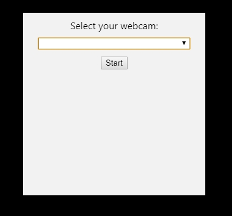

 

Display your webcam video as a floating circle above your other content.

Great for workshop presenters and streamers who want to enhance their screenshare.

 

 

## 📝 Usage

1. Use your preferred tool e.g. Zoom / MsTeams / YouTube to share your screen and audio
    - **Make sure to leave your webcam turned off within these apps**
2. Run WebcamCircle

   
3. Use the dropdown box to select your preferred webcam
4. Once you select this webcam, click "Start" and WebcamCircle will show your video as a floating circle above your other content

5. You can drag-and-drop to move WebcamCircle around your screen
6. Give a great presentation

 

## ⚠️ Limitations

Please make sure WebcamCircle is the only app that is trying to use your web camera at any one time. This means that if you are using MsTeams, then you should turn off your web camera in MsTeams **BEFORE** starting WebcamCircle.

WebcamCircle has been built and tested on Windows 10 only.

 
	
## ⬇️ Download and Run

Use the link below to download the latest copy of WebcamCircle:

 

## 🔍 Key Words

Web Camera / Circle / Overlay / Float / Presentation / Walkthrough / Streaming

 

## 👍 Credits and Attributions

* [Sindre Sorhus](https://github.com/sindresorhus) - [Electron Boilerplate](https://github.com/sindresorhus/electron-boilerplate)
* [Phil Nash](https://github.com/philnash) - [Code to let user select and connect to webcam](https://github.com/philnash/mediadevices-camera-selection/blob/master/app.js)
* [Alyibel Colmenares](https://pixabay.com/users/alyibel-3625842) - [Image used in screenshot](https://pixabay.com/photos/entrepreneur-computer-man-office-2326419)

 

## 🎨 License

Usage is provided under the MIT License. See LICENSE for the full details.

 
